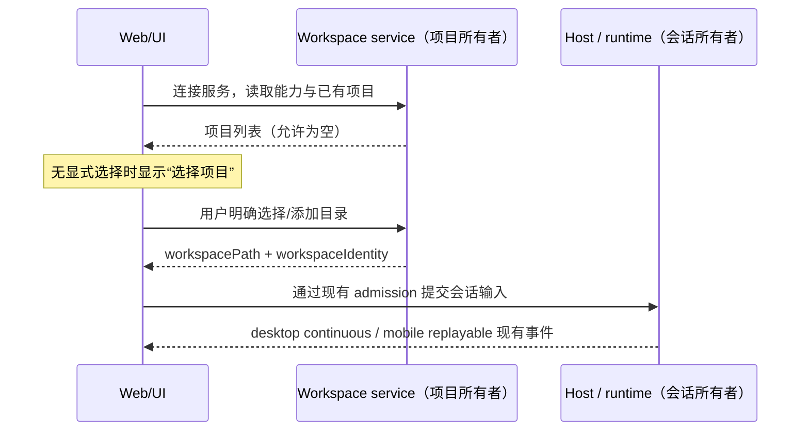

# mycode 品牌与功能验收

## 产品规则

- 应用品牌、第一方包名、协议名、环境变量、数据目录、内部引用及文件名统一使用 mycode（标识符按现有大小写风格）。第三方名称不冒充第一方品牌。
- 用户确认没有可提供的线上服务地址，原地址本身不存在；API/OAuth、CDN、分享页、仓库及文档中的品牌片段也统一改名。此命名变更不代表创建或部署了相应服务。
- 首次启动不自动将服务端进程 cwd 注册为项目；输入框默认显示“选择项目”。项目为空显示 No projects，最近会话为空显示 No chats；中文标题“项目 / 最近的”，英文 Projects / Recents。已明确添加的项目与会话仍可使用。
- 新会话入口使用“新会话 / New chat”。分组、项目切换控件不带前导图标；全部折叠按钮使用垂直方向图标。
- 设置侧栏移除“引导”入口；保留其他已存在的引导功能及快捷键接口。
- 模型与思考深度工具栏没有胶囊背景；发送按钮为圆形，并保留键盘、禁用与运行状态语义。
- 小于 768px 的视口默认收起侧栏，展开为浮层；侧栏状态仍由 useAppPanels 单独拥有。验收必须确认输入框、发送按钮与徽标的实际边界位于视口内，不能只检查页面滚动宽度。
- 截图五为品牌图源。替换应用自身的 PNG、SVG、ICO、ICNS、标签页、标题栏、关于页及启动图；外部供应商与文件类型图标不属于本品牌。
- 启动页覆盖完整视口，使用截图五的冰蓝视觉、流畅的合成动画；尊重减少动态效果偏好，不人为延长启动时间。主页徽标为小尺寸单色透明图，位于问候语上方。
- 依据追加截图反馈，启动徽标宽度收敛到 144–260px（常用桌面约 240px、手机约 144px）。Logo 固定位置，不漂浮、不缩放；保留呼吸光晕、徽标微光与背景星光动画。动态验收同时确认 Logo 边界不变、微光透明度随时间变化，并提供短视频，不能只用静态截图证明动画。
- HTML 启动层的共享 CSS 与图片通过 Vite 模块入口解析，开发模式与生产构建均须成功加载。验收阻止 React 主入口加载，独立检查启动层图片解码、全屏尺寸、动态效果与减少动画偏好。

## 唯一所有者与边界

- 项目列表继续由已有 workspace service / tab store 拥有；Web bootstrap 不再推断用户选择。实际文件 cwd 与 workspaceIdentity 仍分别承担文件操作与身份隔离。
- 会话、自动化、记忆、MCP、子智能体、技能、命令、钩子继续沿现有 service / runtime 契约运行；不新增平行状态或队列。
- 新品牌使用新的存储 key 与目录。旧品牌数据不自动删除或覆盖；无声导入旧项目会违反空初始状态要求，因此不自动导入。
- 品牌资源以仓库内可复用源资产生成各平台分发图标，页面不引用工作区外附件路径。
- macOS 开发应用副本也须在 Info.plist 中声明 mycode.icns，复制同一品牌资源；即使 Electron 二进制缓存命中，图标更新仍须生效，原始 node_modules/Electron.app 不修改。
- 桌面主窗口保持 sandbox 与 contextIsolation；预加载脚本必须包含运行时校验依赖，不能依赖沙箱不提供的第三方 require。原生窗口验收须确认 window.mycode 已暴露、输入框渲染且没有 preload/pageerror。

## 验收证据

- CLI 子工作区采用根目录 hoisted 依赖安装时，命令入口通过 Node 模块解析找到已声明的 Turbo 依赖，不依赖子目录 `.bin` 或全局安装。退出码与信号透传。
- CLI 的 provider registry 只传递当前公开返回的字段；已不存在的 runtime headers 属性不得由调用方假定存在。模型认证继续由现有 provider 配置与运行时负责。

1. 分别记录自动化、computer use、快捷键、记忆、MCP、子智能体、技能、命令、钩子的入口、配置读写、实际执行证据与环境前提；缺少执行证据不得标记完全可用。
2. 补充默认选择/空状态与交互 E2E；检查桌面宽度、移动宽度、明暗主题、减少动画。
3. 扫描第一方文本内容与路径的旧品牌残留；检查所有第一方 Logo 引用和图标尺寸；扫描范围明确排除 Git 历史、依赖与外部用户数据。
4. 执行根目录 typecheck / lint、CLI typecheck / lint、架构检查、相关测试和可运行构建。已有失败与环境阻塞单独记录。

## 当前基线

- workspace freshness 命令失败：远端仓库不可访问（Repository not found）。无法证明本地与远端一致。
- 初始 architecture:check --changed：0 violations / 0 baseline / 0 new。
- 多数源码为 Git 未跟踪文件；保留已有内容，不重置或提交无关改动。
