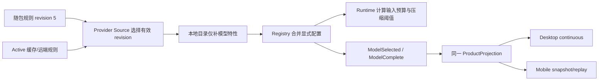

# MyCode 默认上下文窗口 500K

## 产品规则与范围

- 500K 表示 500,000 tokens，是输入与输出共享的总窗口，不是单次输出上限。
- 随包内置模型通用规则默认窗口为 500,000；扫描得到的本地 GGUF 模型继承该规则，不再硬编码 32,768。
- Core 未获得显式窗口时的压缩策略默认值、Contracts 的空会话初始投影默认值同步为 500,000，复用 shared/model-config 的命名常量。
- 显式模型/个人配置、远端新 revision、历史会话事件仍按已有优先级生效，不将模型能力强制取最大值，也不改写历史。
- 保留现有输出上限与压缩缓冲。默认压缩阈值为窗口减去至多 21,000 的输出预留，再减去 13,000 缓冲。本地模型现有输出上限 8,192，对应阈值 478,808；通用规则输出上限 16,384，对应阈值 470,616；无显式输出上限时阈值 466,000。

## 所有者、接口与事件顺序

ProviderConfigService/Registry 是生效模型配置的唯一所有者；Runtime 消费解析后的 properties.contextWindow，客户端只显示协议投影。JSON 随包值与 shared 默认常量通过回归测试约束一致，不新增配置写入路径。

随包 revision 从 4 升至 5，已有 revision 4 Active 缓存通过现有锁和原子物化更新。显式较高版本配置继续生效。协议字段、owner/lease、事件序号、重连及回放规则不变。未知容量的 V4 null 语义不变。

## 验收

1. 内置通用规则和扫描本地模型解析后都是 500,000；既有输出上限保持原值。
2. 旧 revision 4 / 32,768 Active 缓存读取后升级到 revision 5 / 500,000。
3. 本地模型继承自定义通用窗口，不额外覆盖；显式较小窗口仍被压缩策略尊重。
4. 超过旧 32K/200K 窗口但低于新阈值时不自动压缩；达到新阈值时触发。
5. 默认压缩窗口与空会话投影为 500,000；历史显式窗口不被改写。
6. 实时事件投影与事件回放中的 maxTokens 一致为 500,000，模型容量标签为 500K。
7. 执行相关回归、根目录与 CLI 的 typecheck/lint、架构检查；如实记录环境限制与原有失败。

## 失败边界与未验证条件

本任务修改 MyCode 声明和预算，不代表外部模型服务实际已分配 500K KV cache。当前仓库检索未找到 llama-server 启动命令或 ctx-size 配置。要确认外部服务，需其实际启动脚本/服务配置以及运行时容量响应；不推断未读取的文件。超过服务真实容量仍走既有 context-exceeded 错误/响应式压缩路径。500K 实际长请求、模型质量、内存容量和延迟需真实服务验证。
