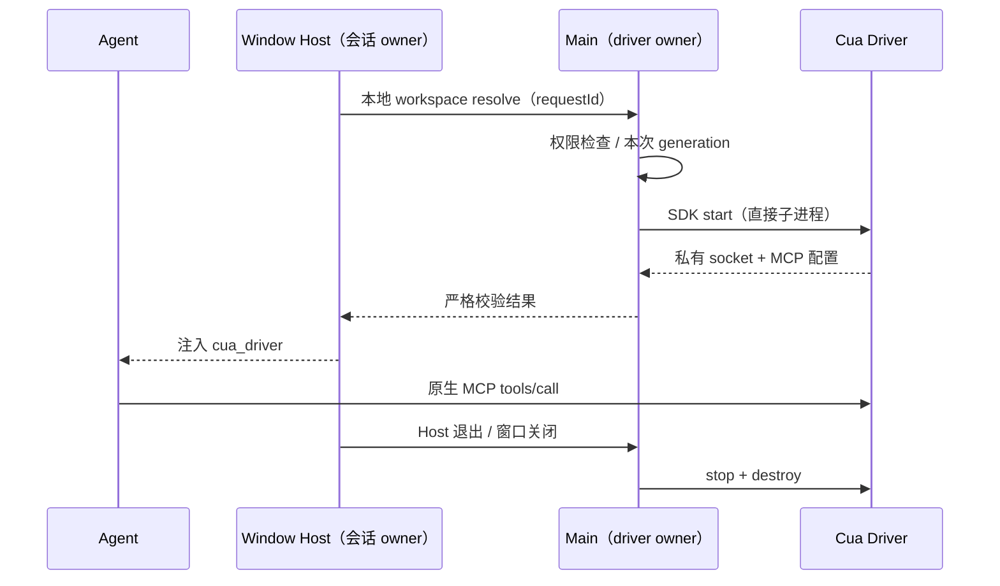
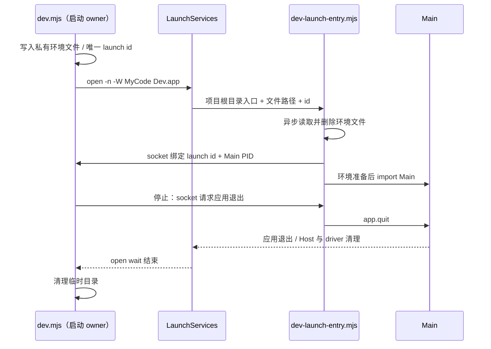

# Cua Driver 原生桌面接入

## 依据与范围

- 引用对话最后确认：以 trycua/cua 的原生 Cua Driver 替换不可用的桌面引擎，保留 MyCode 内置浏览器。
- 当前 `@mycode/mycode-cua` 是不可用占位实现；不恢复已移除的旧 Helper 或插件。
- 上游 `libs/cua-driver/typescript/README.md` 要求 macOS 守护进程由持有权限的应用进程直接启动。
- 使用固定版本 0.30.4 的公开 SDK、平台原生包和 CLI；不导入上游源码内部文件。

## 所有者与接口

- Electron Main 是窗口对应 Cua Driver 的唯一所有者。Host 只请求连接和重启，不保存第二份守护进程状态。
- 通过严格校验的 Main/Host 请求传递连接配置、权限状态或错误；连接不写入用户配置。
- Host 仅对 desktop-local、本地 workspace 注入 `cua_driver` MCP。远端 identity、remoteSessionId 和 standalone server 不获得本机桌面连接。
- 即使没有用户 MCP server，也允许 resolver 注入 Cua Driver。所有其他 MCP server 保持原样。
- 用户自定义同名 `cua_driver` server 不被覆盖；发生冲突时保留用户配置并报告不可注入。只替换本 resolver 创建的实例。
- macOS 查询权限不请求授权；显式 onboarding 或首次调用才请求授权。未授权不启动 daemon。
- 权限布尔值不是功能探针结果。只读状态不伪造 accessibilityProbeOk 或 screenCaptureProbeOk；原生验收必须针对测试窗口实际获取 AX 树与截图。
- Main 使用 SDK 的公开权限请求接口同时登记辅助功能和屏幕录制；实机验收通过 LaunchServices 启动开发 app，不能用终端祖先进程的授权替代应用授权。
- SDK 的 start/stop/restart 负责并发合并、generation 和私有 socket。重启前拒绝活跃 turn；窗口关闭或 Host 退出时停止并销毁。
- 重启后下一次 resolver 取得新连接；不把旧 socket 标记为仍可用，不自动重启 Agent。
- Desktop continuous 与手机 replayable 继续复用已有 Host owner/lease；不为手机或远端启动新 driver。
- 上游原生 MCP 提供工具及 skill resources；旧 `node_repl` CUA API 不作为新接口。
- 新增 `packages/cua-driver-plugin` 作为官方 computer-use 的内容种子，沿用原插件 id 和显式启停；不恢复已移除的旧插件目录。Host 经插件服务读取唯一的启用事实，禁用时不请求本机 driver。

## 验收

1. 空 MCP 列表也能注入；重复 resolve 不添加重复 server。
2. 远端 identity / remoteSessionId 不请求本机 driver；原有 browser server 保留。
3. 并发 resolve 共享 start；启动中 dispose 不返回过期连接；错误回传后 pending 清空。
4. 未授权不启动；状态查询无授权副作用；活跃 turn 不重启。
5. 实际 SDK 加载、daemon 启动、MCP 握手、工具列表、只读桌面观察和退出清理。
6. 浏览器 evaluate 挂起按预算返回，随后仍可执行同步和 Promise.resolve、DOM 与截图。
7. 执行 typecheck、lint、架构检查；平台或系统权限限制必须记录，不当作通过。

## macOS 开发启动

- `dev.mjs` 是开发应用启动与退出的唯一所有者。macOS 使用 LaunchServices 启动已准备的 MyCode Dev.app；Windows/Linux 保持直接 spawn。
- 环境变量通过权限为 0600 的临时 JSON 文件传入。开发入口异步读取并立即删除文件，再加载 Main；凭据不出现在 open 参数或日志中。
- 每次启动使用唯一 launch id 和私有生命周期 socket。开发入口通过 socket 绑定 Main PID；连接关闭即撤销 PID 所有权。Main 会修改 process.title，因此不能依赖命令行匹配或按 app 名称结束实例。
- 停止时通过 socket 请求本次应用退出，必要时仅向仍持有连接的 PID 发 SIGKILL。开发 wrapper 意外退出时，入口检测连接关闭并请求退出。Main 退出后已有 Host/driver 生命周期链负责清理子进程。
- 导入 Main 前恢复 process.argv 的项目入口，避免深链接注册引用需要临时环境文件的开发 wrapper。
- Launcher 保留应用退出等待、renderer URL、cwd 对应的 appPath 与开发环境；临时目录在失败、退出或停止时清理。stdout/stderr 写入权限为 0600 的忽略目录日志；分享前仍需检查并脱敏。

8. 验证环境不泄漏至参数、文件权限和消费后删除；验证私有握手、PID 绑定和连接关闭撤销所有权。
9. 实机验证开发 app 可启动、权限归属、应用关闭和开发停止后的进程清理。
